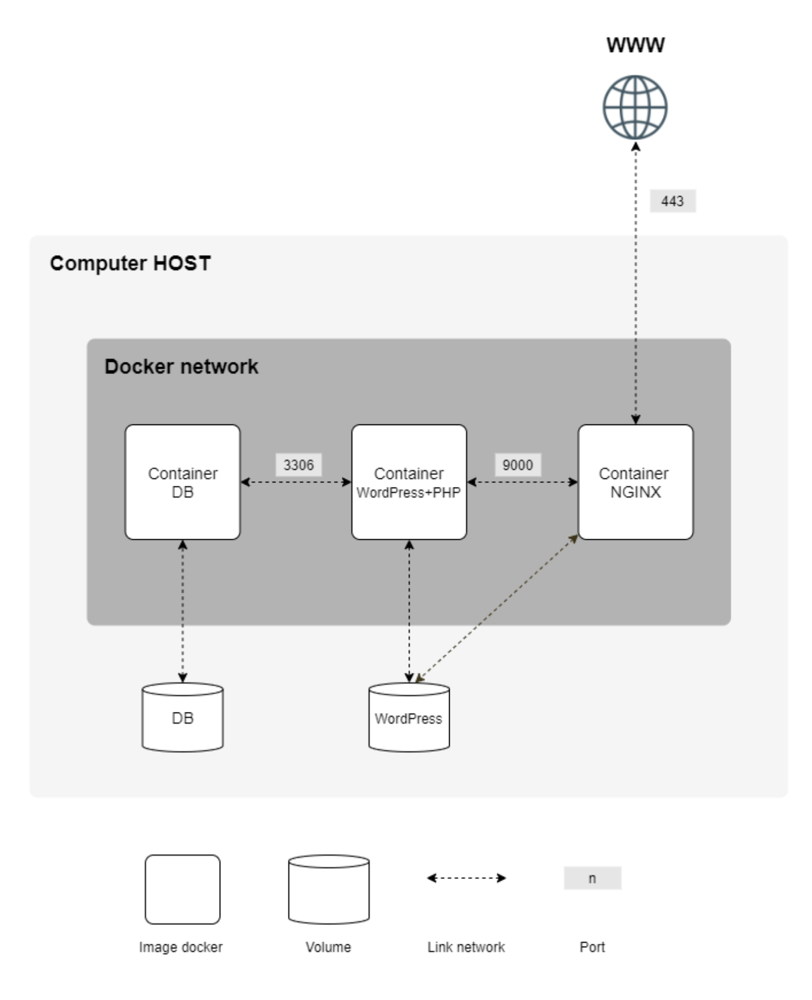

# Inception

## Description

Inception is a comprehensive project at 42 School (École 42) that involves setting up a complete web development environment using Docker containers. The project encompasses various components such as NGINX, WordPress, MariaDB, volumes, Docker networks, Redis cache, FTP server, static website creation, Adminer, and netdata. The goal of Inception is to gain practical experience in configuring and managing web services within a containerized environment.

## Objectives

1. Create a Docker container containing NGINX with TLSv1.2 or TLSv1.3 only.
2. Set up a Docker container containing WordPress + php-fpm, configured without NGINX.
3. Configure a Docker container containing MariaDB, isolated from NGINX.
4. Create a volume to store the WordPress database.
5. Create a second volume to store the WordPress website files.
6. Establish a Docker network to facilitate communication between containers.
7. Implement Redis cache for the WordPress website to optimize caching.
8. Deploy an FTP server container linked to the volume containing the WordPress website files.
9. Develop a simple static website in a language other than PHP (e.g., HTML, CSS, JavaScript).
10. Configure Adminer for easy database management.
11. Set up netdata as a monitoring service to track system performance metrics.

## Installation

To set up the Inception project, follow these steps:

1. Ensure Docker and Docker Compose are installed on your system.

2. Clone the repository:
```bash
git clone https://github.com/abouabra/42-Inception.git
```

3. Navigate to the project directory and then to src folder:
```bash
cd 42-Inception/src/
```
4. Create a .env file in the src folder and add the following environment variables:
```bash
# MariaDB
MARIADB_ROOT_PASSWORD="XXXXXXX"
MARIADB_USER_NAME="XXXXXXX"
MARIADB_USER_PASSWORD="XXXXXXX"
MARIADB_DATABASE_NAME="XXXXXXX"

# WordPress
WORDPRESS_URL="XXXXXXX"
WORDPRESS_TITLE="XXXXXXX"
WORDPRESS_ADMIN_USER="XXXXXXX"
WORDPRESS_ADMIN_PASSWORD="XXXXXXX"
WORDPRESS_ADMIN_EMAIL="XXXXXXX"
WORDPRESS_NORMAL_USER="XXXXXXX"
WORDPRESS_NORMAL_PASS="XXXXXXX"
WORDPRESS_NORMAL_EMAIL="XXXXXXX"

# FTP
FTP_USER="XXXXXXX"
FTP_PASSWORD="XXXXXXX"
```
5. Run the following command to build and start the containers:
```bash
make
```
## Usage

for example if you configured the .env file as follows:
```bash
# MariaDB
MARIADB_ROOT_PASSWORD="root"
MARIADB_USER_NAME="abouabra"
MARIADB_USER_PASSWORD="abouabra"
MARIADB_DATABASE_NAME="wordpress"

# WordPress
WORDPRESS_URL="localhost"
WORDPRESS_TITLE="Inception"
WORDPRESS_ADMIN_USER="abouabra"
WORDPRESS_ADMIN_PASSWORD="abouabra"
WORDPRESS_ADMIN_EMAIL="abouabra@example.com"
WORDPRESS_NORMAL_USER="ayman"
WORDPRESS_NORMAL_PASS="ayman"
WORDPRESS_NORMAL_EMAIL="ayman@example.com"

# FTP
FTP_USER="abouabra"
FTP_PASSWORD="abouabra"
```
You can access the various components as follows:
- WordPress through its configured domain https://localhost
- MariaDB database using Adminer http://localhost/adminer
- netdata to view system performance metrics at http://localhost:8080
- Static website hosted by NGINX at http://localhost/portfolio
- FTP server to upload and manage files for the WordPress website using FileZilla or any compatible FTP client
- Redis cache for optimized caching in the WordPress website


## Infrastructure

## Final Note

If you have any suggestions or feedback, please feel free to open an issue or submit a pull request.
